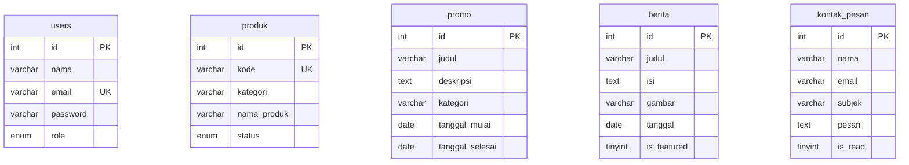

# Walkthrough - Database & PHP Backend RakanPay

## Apa yang Dibuat

## File yang Dibuat (18 file baru)

### Database

| File                                                                    | Fungsi                                                             |
| ----------------------------------------------------------------------- | ------------------------------------------------------------------ |
| [rakanpay.sql](file:///Users/ahmadhanif/rakanpay/database/rakanpay.sql) | Schema 5 tabel + seed data (30 produk, 4 promo, 6 berita, 1 admin) |

### PHP Backend

| File                                                                           | Fungsi                                          |
| ------------------------------------------------------------------------------ | ----------------------------------------------- |
| [config.php](file:///Users/ahmadhanif/rakanpay/config.php)                     | Koneksi PDO MySQL + helper JSON response + CORS |
| [api/produk.php](file:///Users/ahmadhanif/rakanpay/api/produk.php)             | GET produk (search, filter, pagination)         |
| [api/promo.php](file:///Users/ahmadhanif/rakanpay/api/promo.php)               | GET promo (filter kategori)                     |
| [api/berita.php](file:///Users/ahmadhanif/rakanpay/api/berita.php)             | GET berita (featured + list)                    |
| [api/kontak.php](file:///Users/ahmadhanif/rakanpay/api/kontak.php)             | POST simpan pesan kontak                        |
| [api/auth.php](file:///Users/ahmadhanif/rakanpay/api/auth.php)                 | POST login, GET cek session, DELETE logout      |
| [api/admin/produk.php](file:///Users/ahmadhanif/rakanpay/api/admin/produk.php) | CRUD produk (admin only)                        |
| [api/admin/promo.php](file:///Users/ahmadhanif/rakanpay/api/admin/promo.php)   | CRUD promo (admin only)                         |
| [api/admin/berita.php](file:///Users/ahmadhanif/rakanpay/api/admin/berita.php) | CRUD berita (admin only)                        |
| [api/admin/pesan.php](file:///Users/ahmadhanif/rakanpay/api/admin/pesan.php)   | Kelola pesan kontak (admin only)                |

### Halaman Admin

| File                                                                           | Fungsi                                     |
| ------------------------------------------------------------------------------ | ------------------------------------------ |
| [login.html](file:///Users/ahmadhanif/rakanpay/login.html)                     | Halaman login admin (glassmorphism design) |
| [admin-style.css](file:///Users/ahmadhanif/rakanpay/admin-style.css)           | CSS dark theme admin panel                 |
| [admin/dashboard.html](file:///Users/ahmadhanif/rakanpay/admin/dashboard.html) | Dashboard statistik + data terbaru         |
| [admin/produk.html](file:///Users/ahmadhanif/rakanpay/admin/produk.html)       | CRUD produk + search + pagination          |
| [admin/promo.html](file:///Users/ahmadhanif/rakanpay/admin/promo.html)         | CRUD promo + color picker                  |
| [admin/berita.html](file:///Users/ahmadhanif/rakanpay/admin/berita.html)       | CRUD berita/artikel                        |
| [admin/pesan.html](file:///Users/ahmadhanif/rakanpay/admin/pesan.html)         | Lihat & kelola pesan kontak                |

---

## File yang Dimodifikasi

| File                                                         | Perubahan                                          |
| ------------------------------------------------------------ | -------------------------------------------------- |
| [produk.html](file:///Users/ahmadhanif/rakanpay/produk.html) | Tabel dinamis dari API, search, filter, pagination |
| [kontak.html](file:///Users/ahmadhanif/rakanpay/kontak.html) | Form submit via fetch() ke API                     |
| [promo.html](file:///Users/ahmadhanif/rakanpay/promo.html)   | Login link → login.html                            |
| [berita.html](file:///Users/ahmadhanif/rakanpay/berita.html) | Login link → login.html                            |

---

## Cara Menjalankan

### 1. Import Database

```bash
# Buka XAMPP, start Apache & MySQL
# Buka phpMyAdmin (http://localhost/phpmyadmin)
# Import file: rakanpay/database/rakanpay.sql
```

### 2. Jalankan PHP Server

```bash
cd /Users/ahmadhanif/rakanpay
php -S localhost:8000
```

### 3. Akses Website

- **Website**: http://localhost:8000
- **Login Admin**: http://localhost:8000/login.html
  - Email: `admin@rakanponsel.com`
  - Password: `admin123`

---

## Struktur Database


